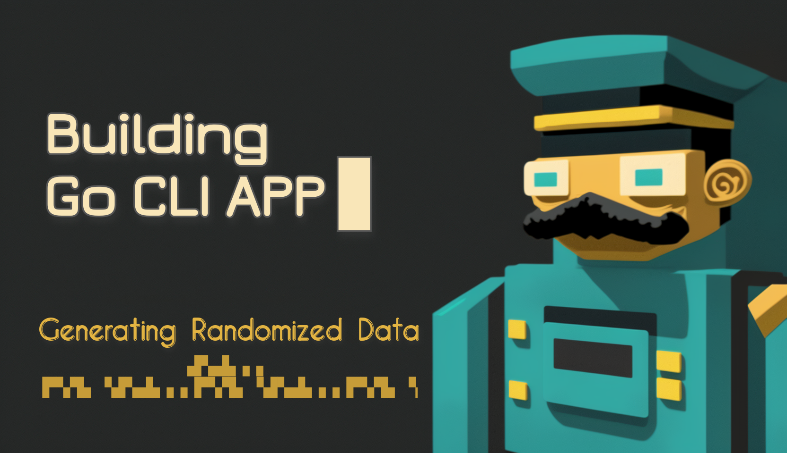

# Building CLI App in Go: Generating Randomized Data

> Want to learn how to build command-line interface (CLI) apps using Go? Join this talk to discover the basics of CLI development and advanced techniques for creating powerful, efficient, and user-friendly CLI apps using Go.

Are you interested in building command-line interface (CLI) apps using Go, but not sure where to start? This engaging talk will provide you with all the information you need to build powerful, efficient, and user-friendly CLI apps using the native “flag” module in Go.

We’ll begin with an introduction to CLI development and explore the advantages of building CLI apps in Go. You’ll then learn about the “flag” module in Go, which is a powerful and flexible way to handle command-line arguments. We’ll cover best practices for building CLI apps using “flag”, including handling user input, parsing data, and generating multiple random data.

You don’t need to be an experienced developer to attend this talk - it’s perfect for both beginners and those with some experience in Go. You’ll come away with practical tips and techniques for building your own CLI apps in Go using the “flag” module, as well as a better understanding of the importance of CLI apps in your workflow.

**Don’t miss this opportunity to take your Go programming skills to the next level and discover the exciting world of CLI app development using the native “flag” module in Go!**

Here is the outline for the talk.

## Prerequisites
* Basic knowledge about [Go Programming Language](https://go.dev/)
* [VSCode](https://code.visualstudio.com/) or [Goland IDE](https://www.jetbrains.com/go/)
* [JSON](https://www.json.org/json-en.html)

## Building CLI App in Go: Generating Randomized Data
### Introduction
* What is a CLI app?
* Why build CLI apps in Go?
* Overview of the “flag” module in Go

### Getting Started with the “flag” module
* Basic syntax and usage
* Command-line arguments and flags
* Parsing user input from command line arguments

### Parsing Data with “flag”
* Parsing strings and numbers
* Validating input
* Converting data types
* Parsing user input from a JSON file

### Generating Multiple Random Data
* Overview of random number generation in Go
* Generating random integers, floats, and other data types
* Advanced techniques for random data generation
* Writing randomized data to an XML file
* Generating data concurrently
* Maintaining sequence while generating data
* Overriding randomized data with pre-defined data

### Conclusion
* Summary of key takeaways
* Additional resources for learning Go and building CLI apps